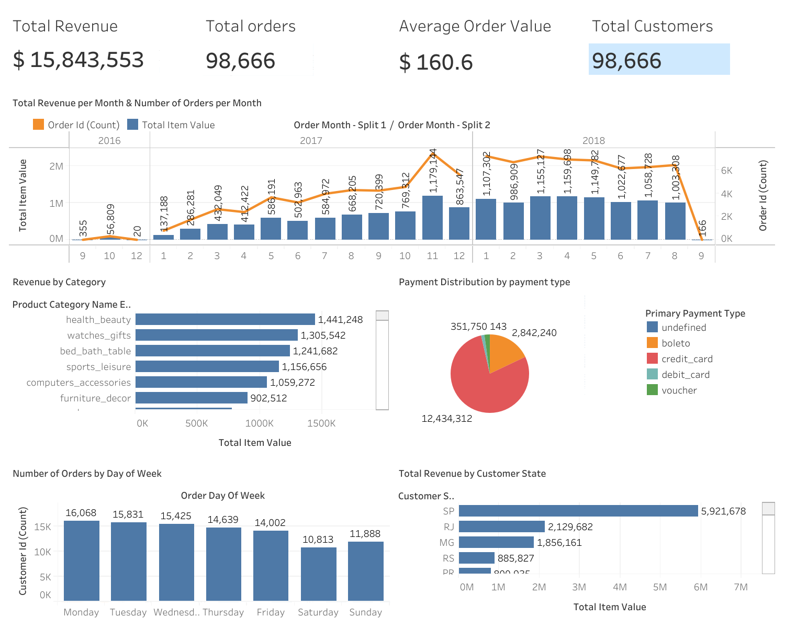
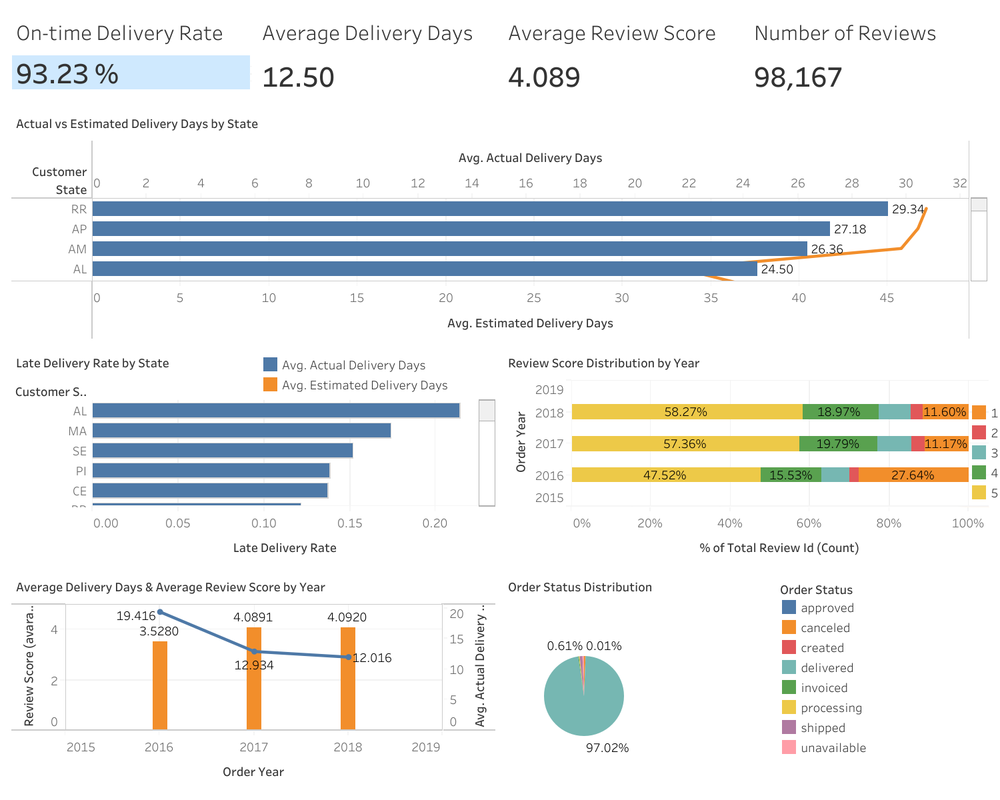

# Tableau Dashboard Instructions for Ecommerce Analytics Pipeline

This document provides step-by-step guidance for building Tableau dashboards using the two dedicated gold mart models created for this purpose. No joins are needed in Tableau — all required fields are pre-joined in the models.

## Dashboard Preview

### Sales Overview

### Operations & Customer Experience

## 1. Data Preparation

### Two Mart Tables to Connect in Tableau

| Gold Mart | Purpose | Grain |
|---|---|---|
| **mart_tableau_sales** | Sales Dashboard (all 5 charts + KPIs) | One row per order item |
| **mart_tableau_ops** | Ops & Customer Experience Dashboard (all 5 charts + KPIs) | One row per order |

### Key Columns in `mart_tableau_sales`

| Column | Description |
|---|---|
| `order_id` | Order identifier |
| `order_item_id` | Item number within order |
| `customer_id` | Customer identifier |
| `order_date` | Purchase date (day) |
| `order_month` | Purchase month in YYYY-MM format |
| `order_day_of_week` | Weekday name (Monday–Sunday) |
| `day_of_week_sort` | Sort key (1=Monday … 7=Sunday) |
| `order_status` | Order status |
| `customer_state` | Customer state (e.g. SP, RJ) |
| `customer_city` | Customer city |
| `product_category_name_english` | English product category |
| `total_item_value` | Revenue: price + freight_value |
| `primary_payment_type` | Payment type (credit_card, boleto, etc.) |
| `primary_payment_value` | Value of primary payment |

### Key Columns in `mart_tableau_ops`

| Column | Description |
|---|---|
| `order_id` | Order identifier |
| `customer_id` | Customer identifier |
| `order_date` | Purchase date (day) |
| `order_year` | Purchase year |
| `order_status` | Order status |
| `customer_state` | Customer state |
| `customer_city` | Customer city |
| `is_delivered` | True if the order was delivered |
| `actual_delivery_days` | Days from purchase to delivery |
| `estimated_delivery_days` | Days from purchase to estimated delivery |
| `delivery_delay_days` | Positive = late, negative = early |
| `is_late_delivery` | True if delivered after estimated date |
| `review_id` | Review identifier (null if no review) |
| `review_score` | Review score 1–5 (null if no review) |
| `review_creation_date` | Date review was submitted |

---

## 2. Tableau Connection Setup

1. Connect Tableau to your data warehouse (Databricks or your configured catalog, schema: `gold`).
2. Add **two** data sources:
   - `mart_tableau_sales` → used for the Sales Dashboard
   - `mart_tableau_ops` → used for the Ops Dashboard
3. No joins are needed — each mart is already a flat, wide table.
4. Build each KPI and chart on its own sheet, then assemble into the two dashboards.
5. Add Highlight Actions last, after all sheets are placed on the dashboard.

---

## 3. Sales Dashboard

### KPIs (Cards) — Data source: `mart_tableau_sales`
- **Total Revenue**: SUM(`total_item_value`)
- **Total Orders**: COUNT(DISTINCT `order_id`)
- **Average Order Value**: SUM(`total_item_value`) / COUNT(DISTINCT `order_id`)
- **Total Customers**: COUNT(DISTINCT `customer_id`)

### Chart 1: Total Revenue per Month (Bar) & Number of Orders per Month (Line)
- **Data source**: `mart_tableau_sales`
- **X-axis**: `order_month` (YYYY-MM) — Tableau will sort this chronologically
- **Bar (left axis)**: SUM(`total_item_value`) — label this "Revenue"
- **Line (right axis)**: COUNT(DISTINCT `order_id`) — label this "Orders"
- **Setup**: Dual-axis chart. Drag `order_month` to Columns. Drag `total_item_value` then `order_id` to Rows. Change mark type for revenue to Bar and orders to Line. Right-click second axis → Dual Axis → Synchronize if needed.
- **Interactivity**: Use Highlight Actions on the Dashboard so clicking the Revenue bar or Orders line highlights corresponding data across all Sales charts.

### Chart 2: Revenue by Category (Bar)
- **Data source**: `mart_tableau_sales`
- **Rows**: `product_category_name_english`
- **Columns**: SUM(`total_item_value`)
- **Sort**: Descending by SUM(`total_item_value`)
- **Interactivity**: Selecting a category highlights Charts 1, 3, 4, and 5.

### Chart 3: Payment Distribution (Pie)
- **Data source**: `mart_tableau_sales`
- **Dimension (Color/Label)**: `primary_payment_type`
- **Measure (Angle/Size)**: SUM(`primary_payment_value`) or COUNT(DISTINCT `order_id`)
- **Mark type**: Pie
- **Interactivity**: Selecting a payment type highlights Charts 1, 2, 4, and 5.

### Chart 4: Number of Orders by Day of Week (Bar)
- **Data source**: `mart_tableau_sales`
- **Columns**: `order_day_of_week`
- **Rows**: COUNT(DISTINCT `order_id`)
- **Sort**: Use `day_of_week_sort` as a sort field (ascending) to enforce Monday → Sunday ordering
- **Interactivity**: Selecting a day highlights Charts 1, 2, 3, and 5.

### Chart 5: Total Revenue by Customer State (Bar)
- **Data source**: `mart_tableau_sales`
- **Columns**: `customer_state`
- **Rows**: SUM(`total_item_value`)
- **Sort**: Descending by SUM(`total_item_value`)
- **Interactivity**: Selecting a state highlights Charts 1, 2, 3, and 4.

### Interactivity Setup (Sales Dashboard)
Dashboard → Actions → Add Action → **Highlight**.
- Source sheets: all 5 Sales chart sheets
- Target sheets: all 5 Sales chart sheets
- Selected fields: `product_category_name_english`, `primary_payment_type`, `customer_state`, `order_day_of_week`, `order_month`

---

## 4. Operations & Customer Experience Dashboard

### KPIs (Cards) — Data source: `mart_tableau_ops`
- **On-time Delivery Rate**: Calculated field → `SUM(IF [is_late_delivery] = false AND [is_delivered] = true THEN 1 ELSE 0 END) / SUM(IF [is_delivered] = true THEN 1 ELSE 0 END)`
- **Average Delivery Days**: AVG(`actual_delivery_days`) — filter: `is_delivered` = true
- **Average Review Score**: AVG(`review_score`)
- **Number of Reviews**: COUNT(`review_id`) — or COUNTD(`review_id`) to exclude nulls

### Chart 1: Actual vs Estimated Delivery Days by State (Bar + Line)
- **Data source**: `mart_tableau_ops` — filter: `is_delivered` = true
- **Columns**: `customer_state`
- **Bar (left axis)**: AVG(`actual_delivery_days`) — mark type: Bar
- **Line (right axis)**: AVG(`estimated_delivery_days`) — mark type: Line
- **Setup**: Drag both measures to Rows to create a dual-axis chart. In the Marks card for `actual_delivery_days` select Bar; for `estimated_delivery_days` select Line. Right-click the `estimated_delivery_days` axis → Dual Axis. Optionally synchronize axes if the scales are similar.
- **Interactivity**: Selecting a state highlights Charts 2, 3, 4, and 5.

### Chart 2: Late Delivery Rate by State
- **Data source**: `mart_tableau_ops` — filter: `is_delivered` = true
- **Columns**: `customer_state`
- **Rows**: Calculated field → `SUM(IF [is_late_delivery] = true THEN 1 ELSE 0 END) / COUNT([order_id])` — label "Late Delivery Rate"
- **Interactivity**: Selecting a state highlights Charts 1, 3, 4, and 5.

### Chart 3: Review Score Distribution by Year (100% Stacked Bar)
- **Data source**: `mart_tableau_ops` — exclude rows where `review_score` is null
- **Columns**: `order_year`
- **Rows**: COUNT(`review_id`)
- **Color**: `review_score` (convert to Dimension, treat as discrete string for distinct color per score 1–5)
- **Stack**: Tableau stacks automatically. Right-click the axis → Add Reference Line or use Table Calculation → Percent of Total (compute using Cell, scope Pane) to make each bar 100%.
- **Interactivity**: Selecting a year or score highlights Charts 1, 2, 4, and 5.

### Chart 4: Average Delivery Days (Bar) & Average Review Score (Line) by Year
- **Data source**: `mart_tableau_ops`
- **Columns**: `order_year`
- **Bar (left axis)**: AVG(`actual_delivery_days`) — filter: `is_delivered` = true
- **Line (right axis)**: AVG(`review_score`) — filter: `review_score` is not null
- **Setup**: Dual-axis chart. Place both measures on Rows, change one to Bar and the other to Line. Move `review_score` axis to the right (Right-click → Dual Axis).
- **Interactivity**: Selecting a year highlights Charts 1, 2, 3, and 5.

### Chart 5: Order Status Distribution (Pie)
- **Data source**: `mart_tableau_ops`
- **Dimension (Color/Label)**: `order_status`
- **Measure (Angle/Size)**: COUNT(`order_id`)
- **Mark type**: Pie
- **Interactivity**: Selecting a status highlights Charts 1, 2, 3, and 4.

### Interactivity Setup (Ops Dashboard)
Dashboard → Actions → Add Action → **Highlight**.
- Source sheets: all 5 Ops chart sheets
- Target sheets: all 5 Ops chart sheets
- Selected fields: `customer_state`, `order_year`, `review_score`, `order_status`
